# ОТЧЕТ о выполнении курсового проекта по дисциплине «Объектно-ориентированное программирование»

Тема:  Приложение WinForms "Записная книга".

Оглавление.

> 1.	Постановка задачи

> 2.	Проектирование	

>> 2.1 Список прецедентов	

>> 2.2 Сущности необходимые для решения	

>> 2.3 Сущности программы и их обязанности для каждого прецедента	

>>> А. Ежедневник

>>> В. Список знакомых	

>>> С. Список напоминаний	

>> 2.4 Диаграмма коммуникаций для каждого прецедента	

>>> А. Ежедневник	

>>> В. Список знакомых	

>>> С. Список напоминаний	

>> 2.5 Детализация сущностей	

>> 2.6 Выделение отношений и переопределение обязанностей	

>> 2.7 Диаграмма классов	

>> 2.8 Реализация программы	
---

1.	Постановка задачи:

Система предназначена для хранения и обработки трех типов данных – список знакомых, ежедневник, список напоминаний. Список знакомых содержит следующую информацию: ФИО, день рождения, адрес телефон, сотовый, краткий комментарий. Ежедневник служит для ведения записей по дням. Список напоминаний содержит информацию о событиях и дату-время.

В системе необходимо реализовать следующие функции: добавление / удаление / модификация / хранение всех видов информации; поиск по ФИО, либо телефону, либо адресу информации о человеке; выдавать предупреждение о ближайших событиях и днях рождениях; просмотр записей ежедневника по датам.

## Проектирование:
### 2.	Список прецедентов:

2.1. Вывести графическое меню выбора приложения.

2.2. Приложение с графическим интерфейсом список знакомых
    - Показать ближайшие дни рождения.
    - Считать данные из хранилища.
    - Реализовать CRUD операции и запись данных в хранилище.

2.3. Приложение с графическим интерфейсом список напоминаний
    - Показать ближайшие события.
    - Считать данных из хранилища.
    - Реализовать CRUD операции и запись данных в хранилище.

2.4. Приложение с графическим интерфейсом ежедневник
    - Считать данных из хранилища.
    - Реализовать CRUD операции и запись данных в хранилище.

### 3.	Сущности необходимые для решения:
- Интерфейс, отвечающий за CRUD модель | interface ICrudModel.
- Сервис для работы с датой и временем | DateTimeParser.
- Сервис для работы с файлами | FileService.
- Основное графическое меню | MenuForm.
- Графическое приложение ежедневник | DiaryFrom.
- Графическое приложение знакомых | FriendListForm.
- Графическое приложение список напоминаний | RemindersForm.
- Модель для работы с ежедневником | DiaryModel.
- Модель для работы с данными записей | DiaryEntry.
- Модель для работы со списком знакомых | FriendListModel.
- Модель для работы с данными контактов | Friend.
- Модель для работы со списком напоминаний | RemindersModel.
- Модель для работы с данными событий | Reminder.

### 4.	Сущности программы и их обязанности для каждого прецедента:

4.1. Выполнить действие по выбору пользователя:
    - Вывести меню выбора приложения.
    - Получить выбор пользователя.
    - Вывести форму ежедневника.
    - Вывести форму списка знакомых.
    - Вывести форму списка напоминаний.

Сущности и обязанности для прецедента: 

*MenuForm* – считывает выбор пользователя и выводит форму по запросу.

#### *A.	Ежедневник.*

1.	Считать выбор пользователя
    - Считать данные из хранилища.
    - Поиск в ежедневнике.
    - Редактирование записи.
    - Удаление записи.
    - Создание записи.

Сущности и обязанности для прецедента: 
- *DiaryForm* – представление, получающее запросы от пользователя.
- *DiaryEntry* – модель отвечающая за работу с данными.
- *DataTimeParser* – сервис для работы с датой и временем.
- *FileService* – сервис для работы с файлами.

2.	Выполнить действие по выбору пользователя:
    - Поиск в ежедневнике.
    - Удаление записи.
    - Редактирование и создание записи
    - Вывести форму редактирования и создания записи.
    - Сохранить данные в хранилище.

Сущности и обязанности для прецедента: 
- *ICrudModel* - интерфейс, отвечающий за CRUD модель, реализовывает взаимодействие представления и реализации.
- *DiaryForm* – представление, отдает приказы на выполнение.
- *DiaryModel* – модель отвечающая за CRUD операции.
- *CreateUpdateDiaryEntryForm* – представление отвечающее за редактирование и создание записи.
- *DiaryEntry* – модель отвечающая за работу с данными.
- *DataTimeParser* – сервис для работы с датой и временем.
- *FileService* – сервис для работы с файлами.

#### *B.	Список знакомых.*

1.	Вывести предупреждение о ближайших днях рождениях.

Сущности и обязанности для прецедента: 
- *FriendListForm* – выводит предупреждение.
- *FriendListModel* – рассчитывает ближайшие дни рождения.
- *DiteTimeParser* – сервис работы с датой и временем.  

2.	Считать выбор пользователя:
    - Считать данные из хранилища.
    - Поиск в списке знакомых.
    - Редактирование контакта.
    - Удаление контакта.
    - Создание контакта.

Сущности и обязанности для прецедента: 
- *FriendListForm* – представление, получающее запросы от пользователя.
- *Friend* – модель отвечающая за работу с данными.
- *DataTimeParser* – сервис для работы с датой и временем.
- *FileService* – сервис для работы с файлами.

3.	Выполнить действие по выбору пользователя:
    - Поиск в списке знакомых.
    - Удаление контакта.
    - Редактирование и создание контакта
    - Вывести форму редактирования и создания контакта.
    - Сохранение данных в хранилище.

Сущности и обязанности для прецедента: 
- *ICrudModel* - интерфейс, отвечающий за CRUD модель, реализовывает взаимодействие представления и реализации.
- *FriendListForm* – представление, отдает приказы на выполнение.
- *FriendListModel* – модель отвечающая за CRUD операции.
- *CreateUpdateFriendForm* – представление отвечающее за редактирование и создание записи.
- *Friend* – модель отвечающая за работу с данными.
- *DataTimeParser* – сервис для работы с датой и временем.
- *FileService* – сервис для работы с файлами.

#### *C.	Список напоминаний.*

1.	Вывести предупреждение о ближайших событиях.

Сущности и обязанности для прецедента: 
- *RemindersForm* – выводит предупреждение.
- *RemindersModel* – рассчитывает ближайшие дни рождения.
- *DiteTimeParser* – сервис работы с датой и временем.

2.	Считать выбор пользователя:
    - Считать данные из хранилища.
    - Поиск в списке напоминаний.
    - Редактирование позиции в списке.
    - Удаление напоминания.
    - Создание напоминания.

Сущности и обязанности для прецедента: 
- *RemindersForm* – представление, получающее запросы от пользователя.
- *Reminder* – модель отвечающая за работу с данными.
- *DataTimeParser* – сервис для работы с датой и временем.
- *FileService* – сервис для работы с файлами.

3.	Выполнить действие по выбору пользователя:
    - Поиск по напоминаниям.
    - Удаление напоминания.
    - Редактирование и создания напоминания
    - Вывести форму редактирования и создания напоминаний.
    - Сохранить данные в хранилище.

Сущности и обязанности для прецедента: 
- *ICrudModel* - интерфейс, отвечающий за CRUD модель, реализовывает взаимодействие представления и реализации.
- *RemandersForm* – представление, отдает приказы на выполнение.
- *RemindersModel* – модель отвечающая за CRUD операции.
- *CreateUpdateReminderForm* – представление отвечающее за редактирование и создание записи.
- *Reminder* – модель отвечающая за работу с данными.
- *DataTimeParser* – сервис для работы с датой и временем.
- *FileService* – сервис для работы с файлами.

### 5.	Диаграмма коммуникаций для каждого прецедента:

1.	Графическое меню выбора приложения:
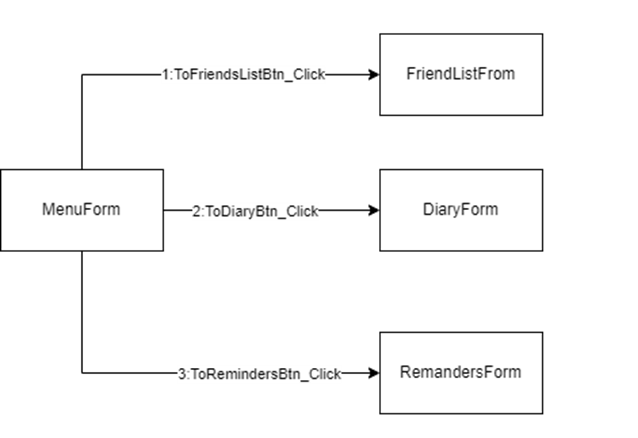

#### *A.	Приложение с графическим интерфейсом ежедневник.*

1.	Считать выбор пользователя

1.1. Считывание данных из хранилища:


1.2. Считать запрос пользователя:
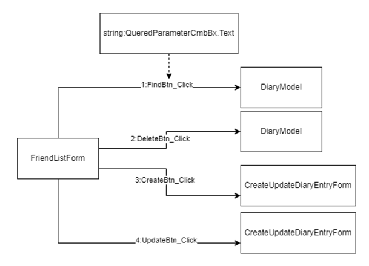

2.	Операции CRUD и запись данных в хранилище.

2.1. Поиск записи:
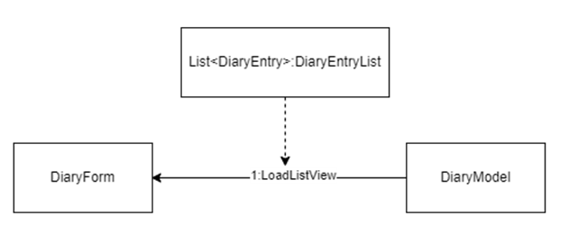

2.2. Удаление записи:
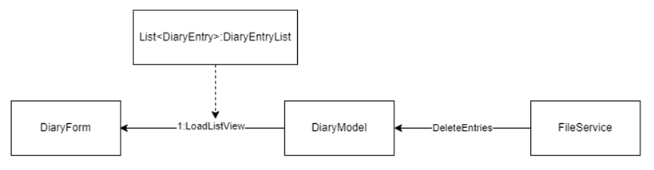

2.3. Создание записи:
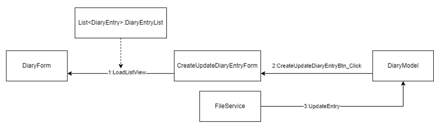

2.4. Редактирование записи:
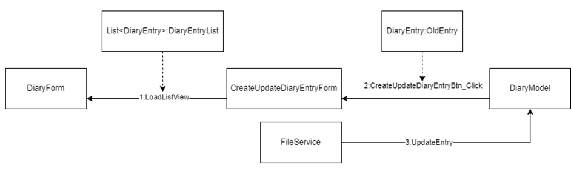

#### *B.	Приложение с графическим интерфейсом список знакомых.*

1.	Вывести предупреждение о ближайших днях рождениях


2. Считать выбор пользователя

2.1. Считать данные из хранилища:
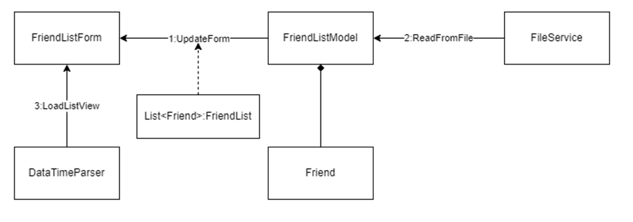

2.2. Считать выбор пользователя:
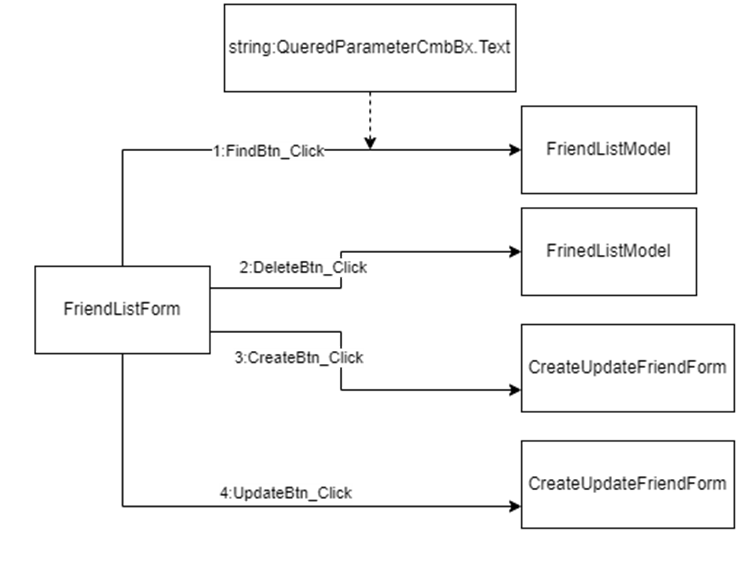

3.	Операции CRUD и запись данных в хранилище

3.1. Поиск контакта знакомого:
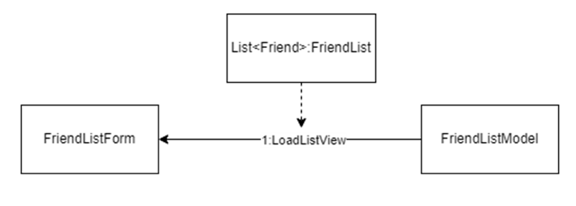

3.2. Удаление контакта знакомого:
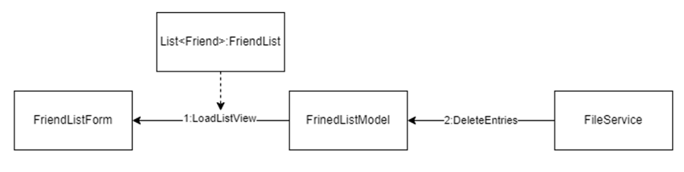

3.3. Создание контакта знакомого:
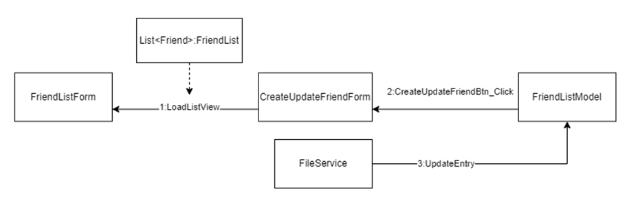

3.4. Редактирование контакта знакомого:
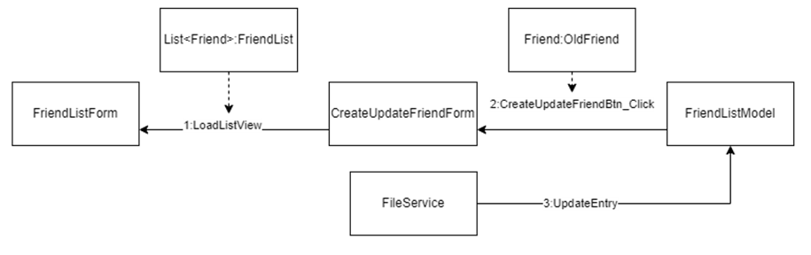

#### *C.	Приложение с графическим интерфейсом список напоминаний.*

1.	Вывести предупреждение о ближайших событиях:
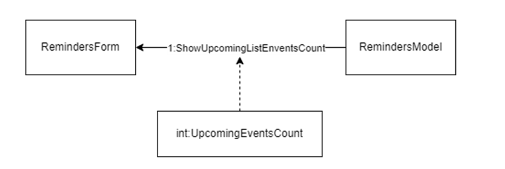

2.	Считать выбор пользователя

2.1. Считывание данных из хранилища:
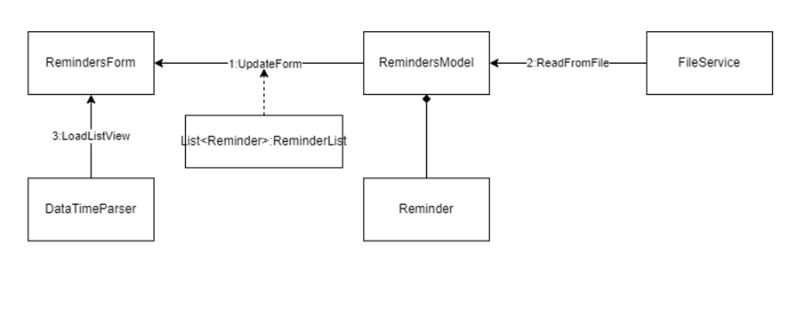

2.2. Считать выбор пользователя:
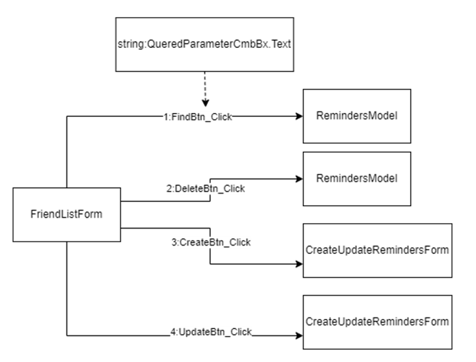

3.	Операции CRUD и запись данных в хранилище

3.1. Поиск события:
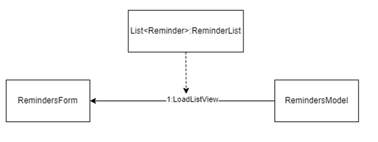

3.2. Удаление события:
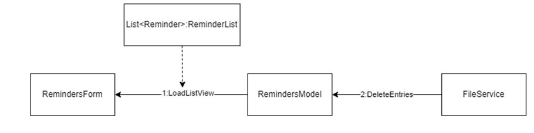

3.3. Создание события:
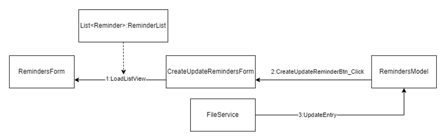

3.4. Редактирование события:
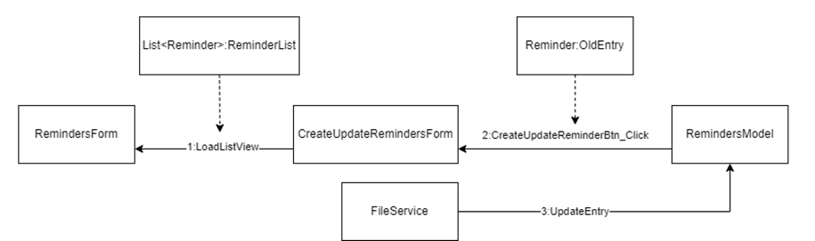

### 6.	Детализация сущностей:

- MenuForm – Actor, меню выбора графического приложения.
    - private ToFriendsListBtn_Click() – выбор списка друзей.
    - private ToDiaryBtn_Click() – выбор ежедневника.
    - private ToRemindersBtn_Click() – выбор списка заметок.
- DiaryForm – Actor, графическое приложение ежедневника.
    > DiaryModel _model.
    - public void UpdateForm().
    - private void LoadListView().
    - private void DeleteBtn_Click().
    - private void FindBtn_Click().
    - private void CreateBtn_Click().
    - private void UpdateBtn_Click().

- CreateUpdateDiaryEntryForm - Actor, форма добавления и обновления записи ежедневника.
    > DiaryModel _model.

    > DiaryForm _parentForm.

    > DiaryEntry _oldEntry.
    - private void CreateUpdateDiaryEntryBtn_Click().

- FriendListForm- Actor, графическое приложение списка друзей.
    > FriendListModel _model.
    - public void UpdateForm().
    - private void LoadListView().
    - private void DeleteBtn_Click().
    - private void FindBtn_Click().
    - private void CreateBtn_Click().
    - private void UpdateBtn_Click().
    - private void ShowUpcomingBirthDateCount().
    - private void FriendListForm_Load().

- CreateUpdateFriendForm- Actor, форма добавления и обновления контактов друзей.
    > FriendListModel _model.

    > FriendListForm _parentForm.

    > Friend _oldFriend.
    - private void CreateUpdateFriendBtn_Click().

- RemindersForm- Actor, графическое приложение списка напоминаний.
    > RemindersModel _model.
    - public void UpdateForm().
    - private void LoadListView().
    - private void DeleteBtn_Click().
    - private void FindBtn_Click().
    - private void CreateBtn_Click().
    - private void UpdateBtn_Click().
    - private void ShowUpcomingEventsCount().
    - private void RemindersForm_Load().

- CreateUpdateReminderForm- Actor, форма добавления и обновления событий.
    > RemindersModel _model.

    > RemindersForm _parentForm.

    > Reminder _oldEntry.
    - private void CreateUpdateReminderBtn_Click().

- ICrudModel – интерфейс, реализующий CRUD модель.
    - void CreateEntry().
    - void UpdateEntry().
    - void DeleteEntries().
    - List<T> FindEntry().

- DiaryModel – модель ежедневника.
    > FileService<DiaryEntry> _fileService.

    > List<DiaryEntry> _diaryEntriesList.

    > string _fileName = "diary.txt".

    > public List<DiaryEntry> DiaryEntriesList.
    - public void CreateEntry().
    - public void DeleteEntries().
    - public List<DiaryEntry> FindEntry().
    - public void UpdateEntry().

- DiaryEntry – модель для работы с данными ежедневника.
    > DateTime _entryDate.

    > string _content.

    > public DateTime EntryDate.

    > public string Content.
    - public override string ToString().
    - public override bool Equals().
    - public override int GetHashCode().
    - private static string DataGridItemToString().

- FriendListModel – модель списка друзей.
    > FileService<Friend> _fileService.

    > List<Friend> _friendsList.

    > string _fileName = "friends.txt".

    > int _upcomingBirthDateCount.

    > public int UpcomingBirthDateCount.

    > public List<Friend> FriendsList.
    - public void CreateEntry().
    - public void UpdateEntry().
    - public List<Friend> FindEntry().
    - public void DeleteEntries().
    - private void CalculateUpcomingBirthDateCount().

- Friend – модель для работы с данными списка друзей.
    > string _fullName.

    > DateTime _birthDate.

    > string _address.

    > string _phoneNumber.

    > string _remark.

    > public string FullName.

    > public DateTime BirthDate.

    > public string Address.

    > public string PhoneNumber.

    > public string Remark.
    - public override string ToString().
    - public override bool Equals().
    - public override int GetHashCode().
    - private static string ListViewItemToString().

- RemindersModel – модель списка напоминаний.
    > FileService<Reminder> _fileService.

    > List<Reminder> _remindersList.

    > string _fileName = "reminders.txt".

    > int _upcomingEventsCount.

    > public List<Reminder> RemindersList.

    >public int UpcomingEventsCount.
    - public void CreateEntry().
    - public void DeleteEntries().
    - public List<Reminder> FindEntry().
    - public void UpdateEntry().
    - private void CalculateUpcomingEventsCount().

- Remider – модель для с данными списка напоминаний.
    > DateTime _eventDate.

    > string _description.

    > DateTime EventDate.

    > string Description.
    - public override string ToString().
    - public override bool Equals().
    - public override int GetHashCode().
    - private static string ListViewItemToString().

- DiteTimeParser – сервис для работы с датой и временем.
    > string[] dateTimeFormats.
    - public static bool TryParse().
    - public static string ToStringWithFormat().

- FileService – сервис для записи и считывания данных.
    > string _workingDirectory.
    - public List<T> ReadFromFile().
    - public void WriteToFile().

### 7.	Выделение отношений и переопределение обязанностей:
- Тип отношений между MenuForm и DiaryForm, FriendListForm, RemindersForm – композиция.
- Тип отношений между DiaryForm и CreateUpdateDiaryFrom – композиция.
- Тип отношений между FriendListForm и CreateUpdateFriendFrom – композиция.
- Тип отношений между RemindersForm и CreateUpdateReminderForm – композиция.
- Тип отношений между ICrudModel и DiaryModel, FriendListModel, RemindersModel – реализации интерфейса.
- Тип отношений между DiaryModel и DiaryEntry – наследования.
- Тип отношений между FriendListModel и Friend – наследования.
- Тип отношений между RemindersModel и Reminder – наследования.
- Тип отношений между DataTimeParser и DiaryEntry, DiaryForm, Reminder, RemindersForm, FrinedListForm – использование.
- Тип отношений между FileService и DiaryModel, FriendListModel, RemindersModel – использование.

### 8.	Диаграмма классов:
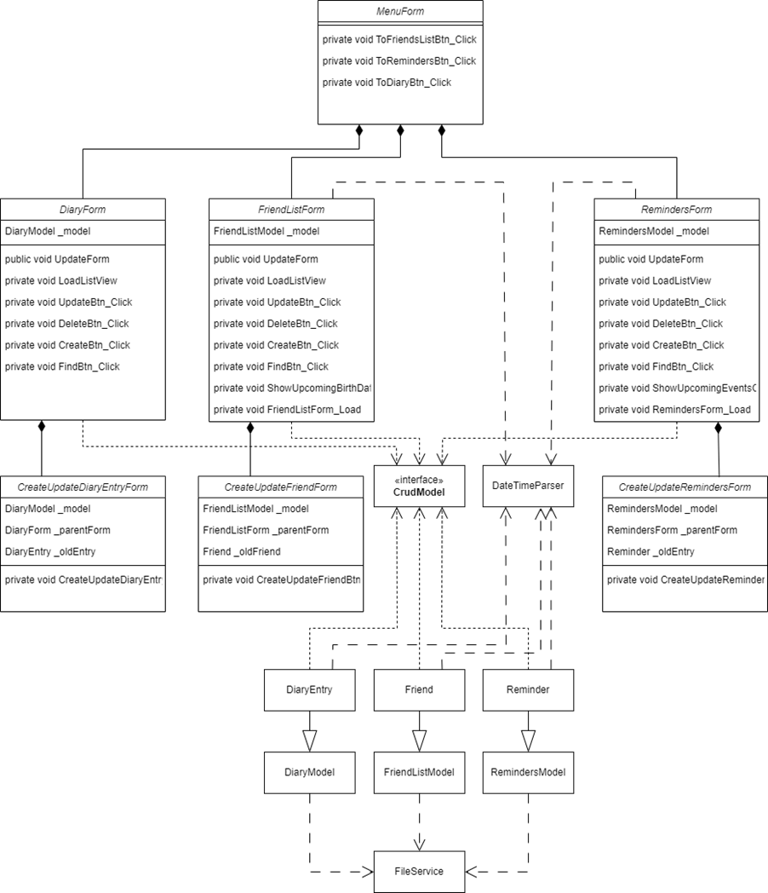

### 9.	Реализация программы:
```C#
> Program.cs
using System;
using System.Collections.Generic;
using System.Linq;
using System.Threading.Tasks;
using System.Windows.Forms;

namespace NotebookApp
{
    internal static class Program
    {
        /// <summary>
        /// Главная точка входа для приложения.
        /// </summary>
        [STAThread]
        static void Main()
        {
            Application.EnableVisualStyles();
            Application.SetCompatibleTextRenderingDefault(false);
            Application.Run(new MenuForm());
        }
    }
}

> MenuForm.cs
using NotebookApp.Views.Diary;
using NotebookApp.Views.FriendsList;
using NotebookApp.Views.Reminders;
using System;
using System.Windows.Forms;

namespace NotebookApp
{
    public partial class MenuForm : Form
    {
        public MenuForm()
        {
            InitializeComponent();
        }
        private void ToFriendsListBtn_Click(object sender, EventArgs e)
        {
            FriendListForm friendsListForm = new FriendListForm();
            friendsListForm.Show();
        }
        private void ToDiaryBtn_Click(object sender, EventArgs e)
        {
            DiaryForm diaryForm = new DiaryForm();
            diaryForm.Show();
        }
        private void ToRemindersBtn_Click(object sender, EventArgs e)
        {
            RemindersForm remindersForm = new RemindersForm();
            remindersForm.Show();
        }
    }
}

> DiaryForm.cs

using NotebookApp.Models;
using NotebookApp.Services;
using System;
using System.Collections.Generic;
using System.Data;
using System.Globalization;
using System.Linq;
using System.Windows.Forms;

namespace NotebookApp.Views.Diary
{
    public partial class DiaryForm : Form
    {
        readonly DiaryModel _model;
        public DiaryForm()
        {
            InitializeComponent();
            _model = new DiaryModel();
            UpdateForm();
        }
        public void UpdateForm()
        {
            List<DiaryEntry> diary = _model.DiaryEntriesList;
            LoadListView(diary);
        }
        private void LoadListView(List<DiaryEntry> listToShow)
        {
            DiaryDataGrid.Rows.Clear();
            var orderedList = listToShow.OrderBy(x => x.EntryDate);
            foreach (var item in listToShow)
            {
                string[] row = { DateTimeParser.ToStringWithFormat(item.EntryDate.Date), item.Content };
                DiaryDataGrid.Rows.Add(row);
            }
        }
        private void DeleteBtn_Click(object sender, EventArgs e)
        {
            if (DiaryDataGrid.Rows != null)
            {
                DialogResult responce = MessageBox.Show("Вы правда хотите удалить эту запись?", "Подтверждение 
удаления", MessageBoxButtons.YesNo);
                if (responce == DialogResult.Yes)
                {
                    var selectedItems = DiaryDataGrid.SelectedRows;
                    _model.DeleteEntries(selectedItems);
                }
                List<DiaryEntry> updatedList = _model.DiaryEntriesList;
                LoadListView(updatedList);
            }
        }
        private void FindBtn_Click(object sender, EventArgs e)
        {
            string queredParameter = QueredParameterCmbBx.Text;
            string query = SearchBox.Text;
            List<DiaryEntry> queredList = _model.FindEntry(queredParameter, query);
            LoadListView(queredList);
        }
        private void CreateBtn_Click(object sender, EventArgs e)
        {
            CreateUpdateDiaryEntryForm createForm = new CreateUpdateDiaryEntryForm(this, _model);
            createForm.Show();
        }
        private void UpdateBtn_Click(object sender, EventArgs e)
        {
            var selectedItem = DiaryDataGrid.SelectedRows[0];
            CreateUpdateDiaryEntryForm createForm = new CreateUpdateDiaryEntryForm(this, _model, selectedItem);
            createForm.Show();
        }
    }
}

> CreateUpdateDiaryEntryForm.cs

using NotebookApp.Models;
using System;
using System.Windows.Forms;

namespace NotebookApp.Views.Diary
{
    public partial class CreateUpdateDiaryEntryForm : Form
    {
        readonly DiaryModel _model;
        readonly DiaryForm _parentForm;
        readonly DiaryEntry _oldEntry;
        public CreateUpdateDiaryEntryForm(DiaryForm parentForm, DiaryModel model, DataGridViewRow oldEntry = 
default)
        {
            InitializeComponent();
            _parentForm = parentForm;
            _model = model;
            if (oldEntry != default)
            {
                _oldEntry = new DiaryEntry(oldEntry);
                EntryDatePicker.Value = _oldEntry.EntryDate;
                ContentTextBox.Text = _oldEntry.Content;
            }
        }
        private void CreateUpdateDiaryEntryBtn_Click(object sender, EventArgs e)
        {
            DiaryEntry newEntry = new DiaryEntry(
                entryDate: EntryDatePicker.Value,
                content: ContentTextBox.Text
                );
            if (_oldEntry == default)
                _model.CreateEntry(newEntry);
            else
            {
                _model.UpdateEntry(_oldEntry, newEntry);
            }
            _parentForm.UpdateForm();
            Close();
        }
    }
}

> FriendListForm.cs

using NotebookApp.Models;
using NotebookApp.Services;
using System;
using System.Collections.Generic;
using System.Data;
using System.Globalization;
using System.Linq;
using System.Windows.Forms;

namespace NotebookApp.Views.FriendsList
{
    public partial class FriendListForm : Form
    {
        readonly FriendListModel _model;
        public FriendListForm()
        {
            InitializeComponent();
            _model = new FriendListModel();
            UpdateForm();
        }
        public void UpdateForm()
        {
            List<Friend> friendList = _model.FriendsList;
            LoadListView(friendList);
        }
        private void LoadListView(List<Friend> listToShow)
        {
            FriendsListView.Items.Clear();
            var orderedList = listToShow.OrderBy(x => x.FullName);
            foreach (var item in listToShow)
            {
                string[] row = { item.FullName, DateTimeParser.ToStringWithFormat(item.BirthDate, "d"), 
item.Address, item.PhoneNumber, item.Remark };
                var listItem = new ListViewItem(row);
                FriendsListView.Items.Add(listItem);
            }
        }
        private void DeleteBtn_Click(object sender, EventArgs e)
        {
            if (FriendsListView.SelectedItems != null)
            {
                DialogResult responce = MessageBox.Show("Вы правда хотите удалить эту запись?", "Подтверждение 
удаления", MessageBoxButtons.YesNo);
                if (responce == DialogResult.Yes)
                {
                    var selectedItems = FriendsListView.SelectedItems;
                    _model.DeleteEntries(selectedItems);
                }
                List<Friend> updatedList = _model.FriendsList;
                LoadListView(updatedList);
            }
        }
        private void FindBtn_Click(object sender, EventArgs e)
        {
            string queredParameter = QueredParameterCmbBx.Text;
            string query = SearchBox.Text;
            List<Friend> queredList = _model.FindEntry(queredParameter, query);
            LoadListView(queredList);
        }
        private void CreateBtn_Click(object sender, EventArgs e)
        {
            CreateUpdateFriendForm createForm = new CreateUpdateFriendForm(this, _model);
            createForm.Show();
        }
        private void UpdateBtn_Click(object sender, EventArgs e)
        {
            ListViewItem selectedItem = FriendsListView.SelectedItems[0];
            CreateUpdateFriendForm createForm = new CreateUpdateFriendForm(this, _model, selectedItem);
            createForm.Show();
        }
        private void ShowUpcomingBirthDateCount()
        {
            MessageBox.Show($"Количество ближайших дней рождений: {_model.UpcomingBirthDateCount}", 
"Предупреждение", MessageBoxButtons.OK);
        }
        private void FriendListForm_Load(object sender, EventArgs e)
        {
            if (_model.UpcomingBirthDateCount != 0) ShowUpcomingBirthDateCount();
        }
    }
}

6.	CreateUpdateFriendForm.cs

using NotebookApp.Models;
using System;
using System.Windows.Forms;

namespace NotebookApp.Views.FriendsList
{
    public partial class CreateUpdateFriendForm : Form
    {
        readonly FriendListModel _model;
        readonly FriendListForm _parentForm;
        readonly Friend _oldFriend;
        public CreateUpdateFriendForm(FriendListForm parentForm, FriendListModel model, ListViewItem oldEntry = 
default)
        {
            InitializeComponent();
            _parentForm = parentForm;
            _model = model;
            if (oldEntry != default)
            {
                _oldFriend = new Friend(oldEntry);
                FullNameTextBox.Text = _oldFriend.FullName;
                BirthDatePicker.Value = _oldFriend.BirthDate;
                AddressTextBox.Text = _oldFriend.Address;
                PhoneTextBox.Text = _oldFriend.PhoneNumber;
                RemarkTextBox.Text = _oldFriend.Remark;
            }
        }
        private void CreateUpdateFriendBtn_Click(object sender, EventArgs e)
        {
            Friend friend = new Friend(fullName: FullNameTextBox.Text,
                                       birthDate: BirthDatePicker.Value,
                                       address: AddressTextBox.Text,
                                       phoneNumber: PhoneTextBox.Text,
                                       remark: RemarkTextBox.Text);
            if (_oldFriend == default)
                _model.CreateEntry(friend);
            else
            {
                _model.UpdateEntry(_oldFriend, friend);
            }
            _parentForm.UpdateForm();
            Close();
        }
    }
}

7.	RemindersForm.cs

using NotebookApp.Models;
using NotebookApp.Services;
using System;
using System.Collections.Generic;
using System.Data;
using System.Globalization;
using System.Linq;
using System.Windows.Forms;

namespace NotebookApp.Views.Reminders
{
    public partial class RemindersForm : Form
    {
        readonly RemindersModel _model;
        public RemindersForm()
        {
            InitializeComponent();
            _model = new RemindersModel();
            UpdateForm();
        }
        public void UpdateForm()
        {
            List<Reminder> remindersList = _model.RemindersList;
            LoadListView(remindersList);
        }
        private void LoadListView(List<Reminder> listToShow)
        {
            RemindersListView.Items.Clear();
            var orderedList = listToShow.OrderBy(x => x.EventDate);
            foreach (var item in listToShow)
            {
                string[] row = { DateTimeParser.ToStringWithFormat(item.EventDate), item.Description };
                var listItem = new ListViewItem(row);
                RemindersListView.Items.Add(listItem);
            }
        }
        private void DeleteBtn_Click(object sender, EventArgs e)
        {
            if (RemindersListView.SelectedItems != null)
            {
                DialogResult responce = MessageBox.Show("Вы правда хотите удалить эту запись?", "Подтверждение 
удаления", MessageBoxButtons.YesNo);
                if (responce == DialogResult.Yes)
                {
                    var selectedItems = RemindersListView.SelectedItems;
                    _model.DeleteEntries(selectedItems);
                }
                List<Reminder> updatedList = _model.RemindersList;
                LoadListView(updatedList);
            }
        }
        private void FindBtn_Click(object sender, EventArgs e)
        {
            string queredParameter = QueredParameterCmbBx.Text;
            string query = SearchBox.Text;
            List<Reminder> queredList = _model.FindEntry(queredParameter, query);
            LoadListView(queredList);
        }
        private void CreateBtn_Click(object sender, EventArgs e)
        {
            CreateUpdateRemindersForm createForm = new CreateUpdateRemindersForm(this, _model);
            createForm.Show();
        }
        private void UpdateBtn_Click(object sender, EventArgs e)
        {
            ListViewItem selectedItem = RemindersListView.SelectedItems[0];
            CreateUpdateRemindersForm createForm = new CreateUpdateRemindersForm(this, _model, selectedItem);
            createForm.Show();
        }
        private void ShowUpcomingEventsCount()
        {
            MessageBox.Show($"Количество ближайших событий: {_model.UpcomingEventsCount}", "Предупреждение", 
MessageBoxButtons.OK);
        }
        private void RemindersForm_Load(object sender, EventArgs e)
        {
            if (_model.UpcomingEventsCount != 0) ShowUpcomingEventsCount();
        }
    }
}

8.	CreateUpdateRemindersForm.cs

using NotebookApp.Models;
using System;
using System.Windows.Forms;

namespace NotebookApp.Views.Reminders
{
    public partial class CreateUpdateRemindersForm : Form
    {
        readonly RemindersModel _model;
        readonly RemindersForm _parentForm;
        readonly Reminder _oldEntry;
        public CreateUpdateRemindersForm(RemindersForm parentForm, RemindersModel model, ListViewItem oldEntry = 
default)
        {
            InitializeComponent();
            _parentForm = parentForm;
            _model = model;
            if (oldEntry != default)
            {
                _oldEntry = new Reminder(oldEntry);
                EventDatePicker.Value = _oldEntry.EventDate;
                EventDescriptionTextBox.Text = _oldEntry.Description;
            }
        }
        private void CreateUpdateReminderBtn_Click(object sender, EventArgs e)
        {
            Reminder newEntry = new Reminder(
                eventDate: EventDatePicker.Value,
                description: EventDescriptionTextBox.Text
                );
            if (_oldEntry == default)
                _model.CreateEntry(newEntry);
            else
            {
                _model.UpdateEntry(_oldEntry, newEntry);
            }
            _parentForm.UpdateForm();
            Close();
        }
    }
}

9.	ICrudModel.cs

using System.Collections;
using System.Collections.Generic;

namespace NotebookApp.Interfaces
{
    internal interface ICrudModel<T>
    {
        void CreateEntry(T newEntry);
        void UpdateEntry(T oldEntry, T modifiedEntry);
        void DeleteEntries(ICollection selectedEntries);
        List<T> FindEntry(string queredParameter, string query);
    }
}

10.	DiaryEntry.cs

using NotebookApp.Services;
using System;
using System.Collections.Generic;
using System.Windows.Forms;

namespace NotebookApp.Models
{
    public class DiaryEntry
    {
        readonly DateTime _entryDate;
        readonly string _content;
        public DateTime EntryDate => _entryDate;
        public string Content => _content;
        public DiaryEntry()
        {
        }
        public DiaryEntry(DateTime entryDate, string content)
        {
            _entryDate = entryDate;
            _content = content;
        }
        public DiaryEntry(DataGridViewRow listViewItem) : this(DataGridItemToString(listViewItem)) { }
        public DiaryEntry(string rawData)
        {
            string[] splitData = rawData.Split(';');
            if (!DateTimeParser.TryParse(splitData[0], out _entryDate))
                _entryDate = DateTime.Now;
            _content = splitData[1];
        }
        public override string ToString()
        {
            return string.Join(";", EntryDate.ToString(), Content);
        }
        public override bool Equals(object obj)
        {
            try
            {
                DiaryEntry diaryEntry = (DiaryEntry)obj;
                return diaryEntry.EntryDate.Date == EntryDate.Date
                    && diaryEntry.Content == Content;
            }
            catch
            {
                return false;
            }
        }
        public override int GetHashCode()
        {
            return base.GetHashCode();
        }
        private static string DataGridItemToString(DataGridViewRow item)
        {
            List<string> unpackedListViewItem = new List<string>();
            foreach (DataGridViewCell subItem in item.Cells)
            {
                unpackedListViewItem.Add((string)subItem.Value);
            }
            return string.Join(";", unpackedListViewItem);
        }
    }
}

11.	DiaryModel.cs

using NotebookApp.Interfaces;
using NotebookApp.Services;
using System;
using System.Collections;
using System.Collections.Generic;
using System.Globalization;
using System.Linq;
using System.Windows.Forms;

namespace NotebookApp.Models
{
    public class DiaryModel : ICrudModel<DiaryEntry>
    {
        readonly FileService<DiaryEntry> _fileService;
        readonly List<DiaryEntry> _diaryEntriesList;
        readonly string _fileName = "diary.txt";
        public List<DiaryEntry> DiaryEntriesList => _diaryEntriesList;
        public DiaryModel()
        {
            _fileService = new FileService<DiaryEntry>();
            _diaryEntriesList = _fileService.ReadFromFile(_fileName);
        }
        public void CreateEntry(DiaryEntry newEntry)
        {
            _diaryEntriesList.Add(newEntry);
            _fileService.WriteToFile(_diaryEntriesList, _fileName);
        }
        public void DeleteEntries(ICollection selectedEntries)
        {
            foreach (DataGridViewRow item in selectedEntries)
            {
                DiaryEntry entryToRemove = new DiaryEntry(item);
                _diaryEntriesList.Remove(entryToRemove);
                _fileService.WriteToFile(_diaryEntriesList, _fileName);
            }
        }
        public List<DiaryEntry> FindEntry(string queredParameter, string query)
        {
            switch (queredParameter)
            {
                case "Дата":
                    return _diaryEntriesList.Where(x => x.EntryDate.Date == DateTime.Parse(query, 
CultureInfo.GetCultureInfo("ru-RU"))).ToList();
                case "Запись":
                    return _diaryEntriesList.Where(x => x.Content.Contains(query)).ToList();
                default:
                    return _diaryEntriesList;
            }
        }
        public void UpdateEntry(DiaryEntry oldEntry, DiaryEntry modifiedEntry)
        {
            int entryIndex = _diaryEntriesList.IndexOf(oldEntry);
            _diaryEntriesList[entryIndex] = modifiedEntry;
            _fileService.WriteToFile(_diaryEntriesList, _fileName);
        }
    }
}

12.	Friend.cs

using System;
using System.Collections.Generic;
using System.Globalization;
using System.Windows.Forms;

namespace NotebookApp.Models
{
    public class Friend
    {
        readonly string _fullName;
        readonly DateTime _birthDate;
        readonly string _address;
        readonly string _phoneNumber;
        readonly string _remark;
        public string FullName => _fullName;
        public DateTime BirthDate => _birthDate;
        public string Address => _address;
        public string PhoneNumber => _phoneNumber;
        public string Remark => _remark;
        public Friend(string fullName, DateTime birthDate, string address, string phoneNumber, string remark)
        {
            _fullName = fullName;
            _birthDate = birthDate;
            _address = address;
            _phoneNumber = phoneNumber;
            _remark = remark;
        }
        public Friend(ListViewItem listViewItem) : this(ListViewItemToString(listViewItem)) { }
        public Friend(string rawData)
        {
            string[] splitData = rawData.Split(';');
            string[] dateFormats = { "dd.MM.yyyy", "G" };
            _fullName = splitData[0];
            if (!DateTime.TryParseExact(splitData[1], dateFormats, null, DateTimeStyles.None, out _birthDate))
                _birthDate = DateTime.Now;
            _address = splitData[2];
            _phoneNumber = splitData[3];
            _remark = splitData[4];
        }
        public Friend() { }
        public override string ToString()
        {
            return string.Join(";", _fullName, _birthDate.ToString(), _address, _phoneNumber, _remark);
        }
        public override bool Equals(object obj)
        {
            try
            {
                Friend friend = (Friend)obj;
                return friend.FullName == FullName
                    && friend.BirthDate.Date == BirthDate.Date
                    && friend.Address == Address
                    && friend.PhoneNumber == PhoneNumber
                    && friend.Remark == Remark;
            }
            catch
            {
                return false;
            }
        }
        public override int GetHashCode()
        {
            return base.GetHashCode();
        }
        private static string ListViewItemToString(ListViewItem item)
        {
            List<string> unpackedListViewItem = new List<string>();
            foreach (ListViewItem.ListViewSubItem subItem in item.SubItems)
            {
                unpackedListViewItem.Add(subItem.Text);
            }
            return string.Join(";", unpackedListViewItem);
        }
    }
}

13.	FriendListModel.cs

using NotebookApp.Interfaces;
using NotebookApp.Services;
using System;
using System.Collections;
using System.Collections.Generic;
using System.Linq;
using System.Windows.Forms;

namespace NotebookApp.Models
{
    public class FriendListModel : ICrudModel<Friend>
    {
        readonly FileService<Friend> _fileService;
        readonly List<Friend> _friendsList;
        readonly string _fileName = "friends.txt";
        int _upcomingBirthDateCount;
        public int UpcomingBirthDateCount => _upcomingBirthDateCount;
        public List<Friend> FriendsList => _friendsList;
        
        public FriendListModel()
        {
            _fileService = new FileService<Friend>();
            _friendsList = _fileService.ReadFromFile(_fileName);
            CalculateUpcomingBirthDateCount();
        }
        public void CreateEntry(Friend newEntry)
        {
            _friendsList.Add(newEntry);
            _fileService.WriteToFile(_friendsList, _fileName);
        }
        public void UpdateEntry(Friend oldEntry, Friend modifiedEntry)
        {
            int entryIndex = _friendsList.IndexOf(oldEntry);
            _friendsList[entryIndex] = modifiedEntry;
            _fileService.WriteToFile(_friendsList, _fileName);
        }
        public List<Friend> FindEntry(string queredParameter, string query)
        {
            switch (queredParameter)
            {
                case "ФИО":
                    return _friendsList.Where(x => x.FullName.Contains(query)).ToList();
                case "Телефон":
                    return new List<Friend> { _friendsList.First(x => x.PhoneNumber.Contains(query)) };
                case "Адрес":
                    return _friendsList.Where(x => x.Address.Contains(query)).ToList();
                default:
                    return _friendsList;
            }
        }
        public void DeleteEntries(ICollection selectedEntries)
        {
            foreach (ListViewItem item in selectedEntries)
            {
                Friend friendToRemove = new Friend(item);
                _friendsList.Remove(friendToRemove);
                _fileService.WriteToFile(_friendsList, _fileName);
            }
        }
        private void CalculateUpcomingBirthDateCount() 
        {
            foreach (Friend eventEntry in FriendsList)
            {
                TimeSpan dateDiff = eventEntry.BirthDate.Date - DateTime.Now.Date;
                if (dateDiff > TimeSpan.Zero && dateDiff < TimeSpan.FromDays(5))
                {
                    _upcomingBirthDateCount++;
                }
            }
        }
    }
}

14.	Reminder.cs

using NotebookApp.Services;
using System;
using System.Collections.Generic;
using System.Windows.Forms;

namespace NotebookApp.Models
{
    public class Reminder
    {
        readonly DateTime _eventDate;
        readonly string _description;
        public Reminder()
        {
        }
        public Reminder(DateTime eventDate, string description)
        {
            _eventDate = eventDate;
            _description = description;
        }
        public DateTime EventDate => _eventDate;
        public string Description => _description;
        public Reminder(ListViewItem listViewItem) : this(ListViewItemToString(listViewItem)) { }
        public Reminder(string rawData)
        {
            string[] splitData = rawData.Split(';');
            if (!DateTimeParser.TryParse(splitData[0], out _eventDate))
                _eventDate = DateTime.Now;
            _description = splitData[1];
        }
        public override string ToString()
        {
            return string.Join(";", EventDate.ToString(), Description);
        }
        public override bool Equals(object obj)
        {
            try
            {
                Reminder reminder = (Reminder)obj;
                return reminder.EventDate == EventDate
                    && reminder.Description == Description;
            }
            catch
            {
                return false;
            }
        }
        public override int GetHashCode()
        {
            return base.GetHashCode();
        }
        private static string ListViewItemToString(ListViewItem item)
        {
            List<string> unpackedListViewItem = new List<string>();
            foreach (ListViewItem.ListViewSubItem subItem in item.SubItems)
            {
                unpackedListViewItem.Add(subItem.Text);
            }
            return string.Join(";", unpackedListViewItem);
        }
    }
}

15.	RemindersModel.cs

using NotebookApp.Interfaces;
using NotebookApp.Services;
using System;
using System.Collections;
using System.Collections.Generic;
using System.Globalization;
using System.Linq;
using System.Windows.Forms;

namespace NotebookApp.Models
{
    public class RemindersModel : ICrudModel<Reminder>
    {
        readonly FileService<Reminder> _fileService;
        readonly List<Reminder> _remindersList;
        readonly string _fileName = "reminders.txt";
        int _upcomingEventsCount;
        public List<Reminder> RemindersList => _remindersList;
        public int UpcomingEventsCount => _upcomingEventsCount;
        public RemindersModel()
        {
            _fileService = new FileService<Reminder>();
            _remindersList = _fileService.ReadFromFile(_fileName);
            CalculateUpcomingEventsCount();
        }
        public void CreateEntry(Reminder newEntry)
        {
            _remindersList.Add(newEntry);
            _fileService.WriteToFile(_remindersList, _fileName);
        }
        public void DeleteEntries(ICollection selectedEntries)
        {
            foreach (ListViewItem item in selectedEntries)
            {
                Reminder entryToRemove = new Reminder(item);
                _remindersList.Remove(entryToRemove);
                _fileService.WriteToFile(_remindersList, _fileName);
            }
        }
        public List<Reminder> FindEntry(string queredParameter, string query)
        {
            switch (queredParameter)
            {
                case "Дата":
                    return _remindersList.Where(x => x.EventDate.Date == DateTime.Parse(query, 
CultureInfo.GetCultureInfo("ru-RU"))).ToList();
                case "Событие":
                    return _remindersList.Where(x => x.Description.Contains(query)).ToList();
                default:
                    return _remindersList;
            }
        }
        public void UpdateEntry(Reminder oldEntry, Reminder modifiedEntry)
        {
            int entryIndex = _remindersList.IndexOf(oldEntry);
            _remindersList[entryIndex] = modifiedEntry;
            _fileService.WriteToFile(_remindersList, _fileName);
        }
        private void CalculateUpcomingEventsCount()
        {
            foreach (Reminder eventEntry in RemindersList)
            {
                TimeSpan dateDiff = eventEntry.EventDate.Date - DateTime.Now.Date;
                if (dateDiff > TimeSpan.Zero && dateDiff < TimeSpan.FromDays(5))
                {
                    _upcomingEventsCount++;
                }
            }
        }
    }
}

16.	DateTimeParser.cs

using System;
using System.Globalization;

namespace NotebookApp.Services
{
    public static class DateTimeParser
    {
        static readonly string[] dateTimeFormats = { "dd.MM.yyyy", "dd.MM.yyyy H:mm:ss", "G", "M/d/yyyy h:mm:ss 
tt" };
        public static bool TryParse(
            string s,
            out DateTime result,
            DateTimeStyles style = DateTimeStyles.None)
        {
            return DateTime.TryParseExact(s, dateTimeFormats, CultureInfo.InvariantCulture, style, out result);
        }
        public static string ToStringWithFormat(DateTime dt, string format = "G")
        {
            return dt.ToString(format, CultureInfo.GetCultureInfo("ru-RU"));
        }
    }
}

17.	FileService.cs

using System;
using System.Collections.Generic;
using System.IO;

namespace NotebookApp.Services
{
    public class FileService<T> where T : new()
    {
        readonly string _workingDirectory;
        public FileService(string workingDirectory = "../../io")
        {
            if (!Directory.Exists(workingDirectory))
            {
                Directory.CreateDirectory(workingDirectory);
            }
            _workingDirectory = workingDirectory;
        }
        public List<T> ReadFromFile(string fileName)
        {
            List<T> fileInfo = new List<T>();
            string fullPath = Path.Combine(_workingDirectory, fileName);
            if (File.Exists(fullPath))
            {
                using (StreamReader sr = new StreamReader(fullPath))
                {
                    while (!sr.EndOfStream)
                    {
                        var line = sr.ReadLine();
                        if (!string.IsNullOrEmpty(line))
                        {
                            T anotherPieceOfInfo = (T)Activator.CreateInstance(typeof(T), args: line);
                            fileInfo.Add(anotherPieceOfInfo);
                        }
                    }
                }
            }
            return fileInfo;
        }
        public void WriteToFile(List<T> info, string fileName)
        {
            string fullPath = Path.Combine(_workingDirectory, fileName);
            using (StreamWriter sw = new StreamWriter(fullPath))
            {
                foreach (T item in info)
                {
                    sw.WriteLine(item.ToString());
                }
            }
        }
    }
}
```
